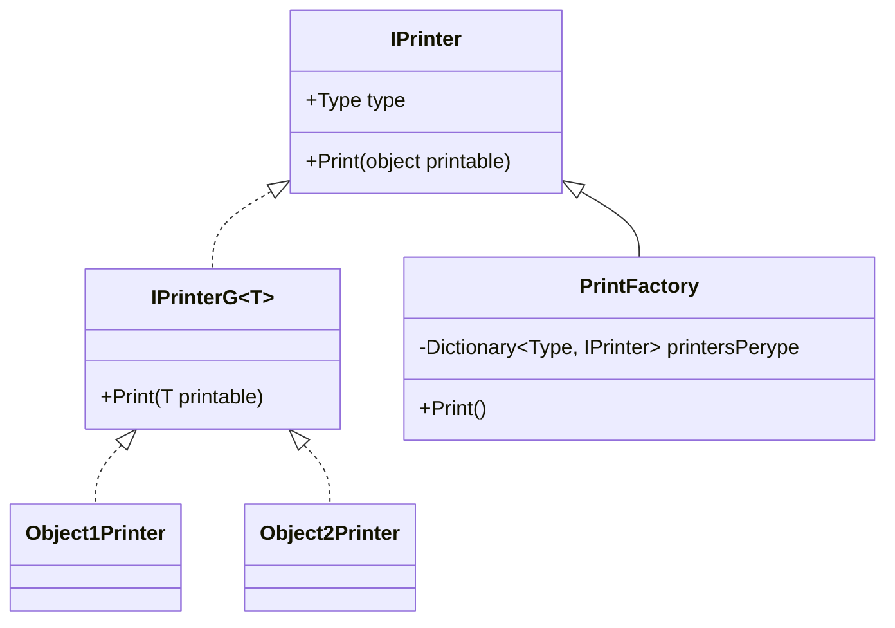

# Composición para no tener complejidad

Usar herencia para usar composición y evitar la complejidad

---

# Contenido

<Toc minDepth="1" maxDepth="2"></Toc>

---

# Definición del problema

- Quiero hacer una aplicación de consola que pinte entidades
- Estas entidades vienen de una "_base de datos_"
- Todas estas entidades solo tienen en común un campo _id_, el resto de propiedades no son comunes

<!--
Básicamente hay que hacer un planteamiento rápido del problema de la aplicación de consola
-->

---

# Los modelos de ejemplo

<div grid="~ cols-2 gap-4">
```csharp
public class AverageModel : IModel
{
    public int Id { get; set; }
    
    public string? Description { get; init; }
    public string? CustomField1 { get; init; }
}
```

```csharp
public class SuperModel : IModel
{
    public int Id { get; set; }
    
    public string? Description { get; init; }
    public string? CustomField2 { get; init; }
}
```

```csharp
public interface IModel
{
    int Id { get; set; }
}
```
</div>

<!--
Pasar rápidamente por aquí, esta diapositiva no tiene mayor misterio
-->

---

# El contexto

```csharp
public class SuperContext
{
    public List<AverageModel> AverageModel { get; set; }

    public List<SuperModel> SuperModel { get; set; } 
}
```

<!--
Pasar rápidamente por aquí, esta diapositiva no tiene mayor misterio
-->

---

# Primera aproximación

<div grid="~ cols-2 gap-4">
  <div>
  <h5 class="text-gray">La aplicación monolítica</h5>

  ```csharp
  const int nUnderscore = 80;

  var context = new SuperContext();

  foreach (var averageModel in context.AverageModel)
  {
      Console.WriteLine(averageModel.Id);
      Console.WriteLine(averageModel.Description);
      Console.WriteLine(averageModel.CustomField1);
      Console.WriteLine(new string('-', nUnderscore));
  }

  foreach (var averageModel in context.SuperModel)
  {
      Console.WriteLine(averageModel.Id);
      Console.WriteLine(averageModel.Description);
      Console.WriteLine(averageModel.CustomField2);
      Console.WriteLine(new string('-', nUnderscore));
  }
  ```
  </div>
  <div v-click>
    <h5 class="text-gray">Problemas</h5>
    <ul>
      <li>
        Crece fatal
      </li>
      <li>
        <span v-mark.red="3">Es difícil de mantener</span>
      </li>
      <li>
        Obliga a saber la implementación
      </li>
      <li>
        No es testeable
      </li>
    </ul>
  </div>
</div>

<!--
¿Qué es la aproximación monolítica? Hacer un Program.cs con todos los modelos a cholón
Hacer clic para sacar la parte de los problemas
Crece fatal: Podríamos llegar a tener un código de miles de lineas
Es difícil de mantener: Quiero cambiar los guiones por otra cosa, o cambiar el orden de algo
Obliga a saber la implementación: En un entorno con tantos proyectos puede no ser asumible saber la implementación de todos los proyectos
-->

---

# Segunda aproximación

Estructura con factorías e interfaces

```csharp {all|8-11} twoslash
// FALTA EL CÓDIGO PARA DAR DE ALTA SERVICIOS

using var scope = serviceProvider.CreateScope();

var slashFactory = scope.ServiceProvider.GetService<SlashFactory>();
var underscoreFactory = scope.ServiceProvider.GetService<UnderscoreFactory>();

Console.WriteLine("_-_-_-_- SLASH FACTORY _-_-_-_-");
slashFactory?.Print();
Console.WriteLine("_-_-_-_- UNDERSCORE FACTORY _-_-_-_-");
underscoreFactory?.Print();
```

<!--
Estructura con factorías en interfaces
Tenemos dos factorias, una que pinta con slash y otra que pinta con underscore
Recalcar que falta el código para dar de alta servicios, que está en el ejemplo completo que pasaré más adelante
Este código está terminado, no hay quye tocarlo nunca más
-->

---
level: 2
---

# Definición de las interfaces

La interfaz define una capacidad


```csharp {all|9-13|1|3|6|4} twoslash
public interface IPrinter<in TModel> : IPrinter where TModel : IModel
{
    Type IPrinter.TypeToPrint => typeof(TModel);
    string Print(TModel printable);

    string IPrinter.Print(object printable) => Print((TModel)printable);
}

public interface IPrinter
{
    Type TypeToPrint { get; }
    string Print(object printable);
}
```

<!--
Tenemos dos interfaces, una que es la que implementaremos nosotros y otra que se usará para las factorías
IPrinter<in TModel> es la que implementaremos nosotros
IPriner es la que usaran las factorías

¿Porque esta diferenciación? Porque todos queremos programar con tipos, no queremos dinámicos ni cosas de esas
-->

---
level: 2
---

# Implementación de las interfaces

```csharp {all|1,13|3,15} twoslash
public class AverageModelPrinter : IPrinter<AverageModel>
{
    public string Print(AverageModel printable)
    {
        var sb = new StringBuilder();
        sb.AppendLine(printable.Id.ToString());
        sb.AppendLine(printable.Description);
        sb.AppendLine(printable.CustomField1);
        return sb.ToString();
    }
}

public class SuperModelPrinter : IPrinter<SuperModel>
{
    public string Print(SuperModel printable)
    {
        var sb = new StringBuilder();
        sb.AppendLine(printable.Id.ToString());
        sb.AppendLine(printable.Description);
        sb.AppendLine(printable.CustomField2);
        return sb.ToString();
    }
}
```
<!--
Con esto conseguimos que si queremos que alguien se meta al proyecto sólo tenga que saber hacer esto, no tiene que saber nada mas del proyecto
-->

---
level: 2
---

# Cómo usar las interfaces

```csharp {all|4,8|17|20} twoslash
public class SlashFactory
{
    private readonly List<IModel> _models = []; // Se rellenan en otro lado
    private readonly Dictionary<Type, IPrinter[]> _printersPerType;

    public SlashFactory(IEnumerable<IPrinter> printers)
    {
      _printersPerType = printers.GroupBy(p => p.TypeToPrint).ToDictionary(p => p.Key, p => p.ToArray());
    }

    public void Print()
    {
        const int nUnderscore = 80;

        foreach (var model in _models)
        {
            var modelPrinters = _printersPerType[model.GetType()];
            foreach (var modelPrinter in modelPrinters)
            {
                Console.Write(modelPrinter.Print(model));
                Console.WriteLine(new string('/', nUnderscore));
            }
        }
    }
}
```

<!--
Al usar la implementación general, podemos usarla fácilmente con la DI de Microsoft y usarla como queramos
Con el uso del Type, podemos asegurarnos de que el tipo que se pasa al método de pintar es un objeto válido
-->

---

# Problemas de esta implementación

- Aumenta la complejidad de la aplicación
- Usa objetos no tipados para funcionar

---

# Esquema UML



---

# Recursos

- <a href="https://github.com/juanDeVicente/ExampleComposition" target="_blank" alt="GitHub" title="Enlace de Github con el proyecto de ejemplo"
    class="text-xl slidev-icon-btn opacity-50 !border-none !hover:text-white">
    <carbon-logo-github />
  </a>
  Código de ejemplo
- <a href="hhttps://github.com/juanDeVicente/ComposicionSobreHerenciaSlides" target="_blank" alt="GitHub" title="Enlace de Github con las diapositivas"
    class="text-xl slidev-icon-btn opacity-50 !border-none !hover:text-white">
    <carbon-logo-github />
  </a>
  Diapositivas de la presentación

---
layout: center
class: text-center
---

# ¿Dudas y preguntas?
